<div align="center">

# 16-Input AND Gate — Logical Effort Delay Optimization

### Minimum-delay CMOS gate design using logical effort theory, optimum staging, and topology comparison


</div>

---

## 1. Project Summary

| Item | Details |
|---|---|
| Project | 16-Input AND Gate — Minimum Delay Design |
| Tool Used | Cadence Virtuoso |
| Technology | CMOS Transistor-Level Design |
| Method | Logical Effort Theory |
| Techniques | Optimum Staging, Multi-Stage Buffering, Transistor Sizing, Topology Comparison |
| Load | 4000 units (Cout = 62,800 in normalized logical-effort units) |
| Best Result | 40.05 ps absolute delay (Configuration 1: NAND-2 + NOR-2 chain) — a 71.5% reduction from the baseline |

---

## 2. Engineering Problem

Implement a 16-input AND gate with the **lowest possible delay**. The input signal passes through the smallest inverter (input capacitance = 3), then through the AND gate logic, driving a load of 4000 units. Output polarity must match the input.

A direct 16-input gate is impractical: a single-stage implementation would require extreme transistor stacking, which increases series resistance and propagation delay far beyond what any reasonable sizing could compensate for. The gate must therefore be decomposed into a logic tree of smaller gates — and logical effort theory is used to choose *how* that decomposition happens, rather than guessing.

---

## 3. Design Flow

```
Problem Specification (16-input AND, load = 4000 units)
        ↓
Baseline Design (4-input NAND + 4-input NOR)
        ↓
Logical Effort Calculation (G, H, F)
        ↓
Transistor Sizing per Gate
        ↓
Simulation & Delay/Energy Measurement
        ↓
Optimum Stage Count Derivation
        ↓
Multi-Stage Buffer Insertion
        ↓
Configuration Comparison (3 topologies)
        ↓
Best Configuration Selection & Final Validation
```

---

## 4. Theory — Logical Effort

Logical effort models gate delay as a function of the gate's intrinsic drive capability (**logical effort, g**), its intrinsic parasitic delay (**p**), and the ratio between load and input capacitance (**h**, the electrical effort). For a multi-stage path:

- **Path effort:** F = G · B · H, where G is the product of each stage's logical effort, B accounts for branching, and H is the ratio of output load to input capacitance
- **Optimum stage count:** N = log₄(F) — the path length that minimizes total delay
- **Per-stage effort:** f = F^(1/N), used to size every stage so each contributes equally to the total delay
- **Minimum delay:** d_min = N·f + ΣP (sum of parasitic delays)

This theory drives every optimization decision in this project: how many stages to use, how to size each gate, and which gate topology minimizes the path effort G.

*(Note: the unit inverter delay τ = 0.9006 ps, used to convert normalized delay into absolute picoseconds throughout this project, was characterized separately via an FO4 (fanout-of-4) simulation and is used here as a given process constant.)*

---

## 5. Baseline Design — NAND4 + NOR4

The most direct decomposition of a 16-input AND function is four 4-input NAND gates (grouping the 16 inputs) feeding a single 4-input NOR gate to restore correct polarity.

| 16-Input AND Gate (NAND4 + NOR4) | NAND4 Transistor-Level | NOR4 Transistor-Level |
|---|---|---|
| 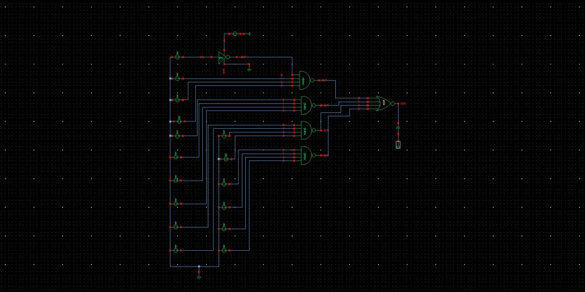 | 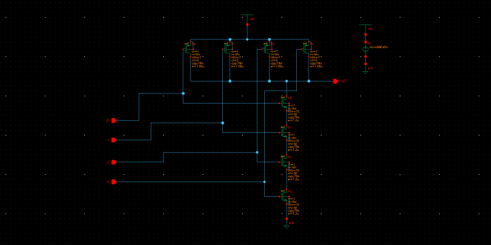 | 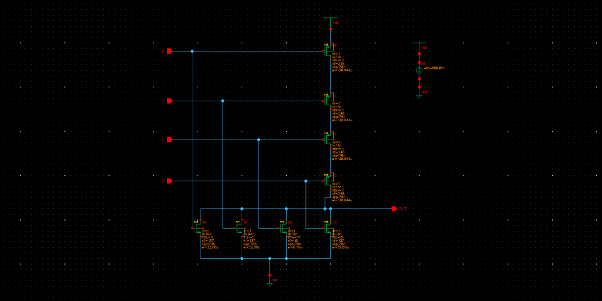 |

### Logical Effort Calculation

For a 4-input NAND: G = 10c/4c = 2.5, P = 16c/4c = 4
For a 4-input NOR: G = 10c/4c = 2.5, P = 16c/4c = 4

With 1 branch (B = 1) and 3 logic stages (inverter → NAND4 → NOR4):

```
F = g_inv · g_nand · g_nor · B · h = 1 × 2.5 × 2.5 × 62800/4 = 98125
f_cap = F^(1/3) = 46
```

### Transistor Sizing (P:N ratios)

| Gate | P:N Ratio | Result |
|---|---|---|
| Inverter | 2:2 | P = 2, N = 2 |
| NAND4 | 1:4 | P = 37, N = 148 |
| NOR4 | 4:1 | P = 2732, N = 683 |

### Baseline Results

**Calculated:** d_min = 147, D_abs = 147 × τ = **132.3 ps**

**Simulated (measured):**

| Delay | Value |
|---|---|
| Rising Delay | 209.183 ps |
| Falling Delay | 71.6732 ps |
| Average Delay | 140.4281 ps |

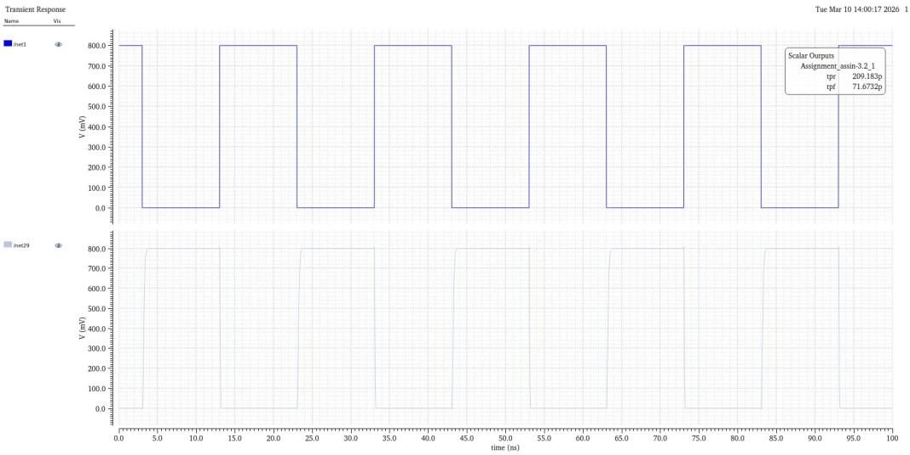

| Energy | Value |
|---|---|
| Static Energy | 6.547 fJ |
| Dynamic Energy | 9.49 pJ |
| Total Energy | 9.504 pJ |

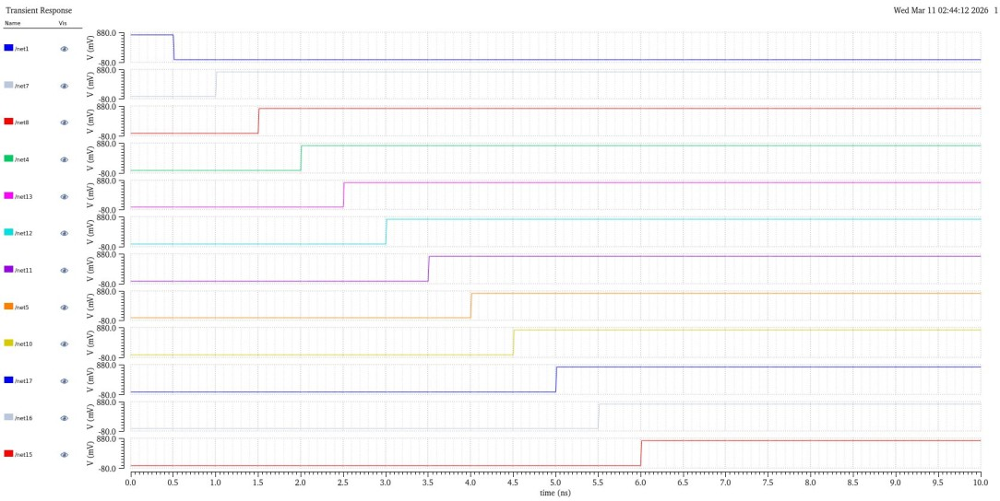

**Observation:** measured delay exceeds the calculated value because the theoretical logical-effort model doesn't account for parasitic capacitance, and the large output load extends switching time beyond the first-order estimate.

---

## 6. Optimization Strategy

### 6.1 Design Decisions

A direct 3-stage implementation (inverter → NAND4 → NOR4) forces each stage to drive a very large effective fanout in a single hop, which is exactly what inflates the measured delay above the theoretical minimum. Logical effort theory shows this path is far shorter than its effort actually calls for. Two independent levers were used to close that gap:

1. **Restage the path** to its logical-effort-optimal length (more, smaller stages instead of few, large ones)
2. **Reduce the logical effort per stage** by preferring smaller fan-in gates (2-input over 4-input) wherever the logic allows it

Both reduce delay through the same underlying mechanism — lowering the effort each stage has to overcome — but they involve different costs, discussed below.

### 6.2 Optimum Number of Stages

```
N = log4(F) = log4(98125) = 8.3 → N ≈ 9 stages
```

This means **6 buffer stages** need to be inserted between the logic gates and the output load to minimize delay — spreading the same total effort across more, smaller jumps instead of one large one.

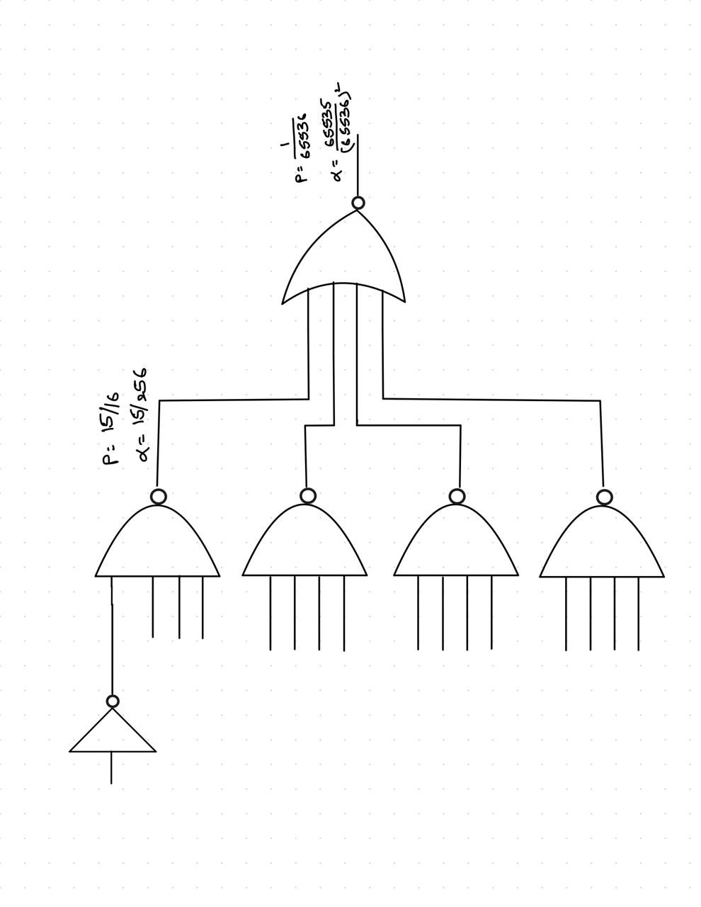

With N = 9, the per-stage effort becomes `f_cap = (98125)^(1/9) = 3.58`, giving evenly-distributed capacitances at each stage (from ~17,542 units down to 4 units at the input), instead of one large jump from a 4-unit inverter straight to a 62,800-unit load.

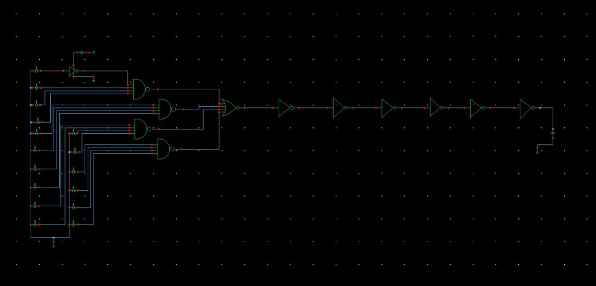

**Results — 9-Stage Buffered Design**

Calculated: d_min = 9 × 3.58 + 15 = 47.22, D_abs ≈ **42.5 ps**

| Delay | Value |
|---|---|
| Rising Delay | 59.7064 ps |
| Falling Delay | 47.8165 ps |
| Average Delay | 53.76145 ps |

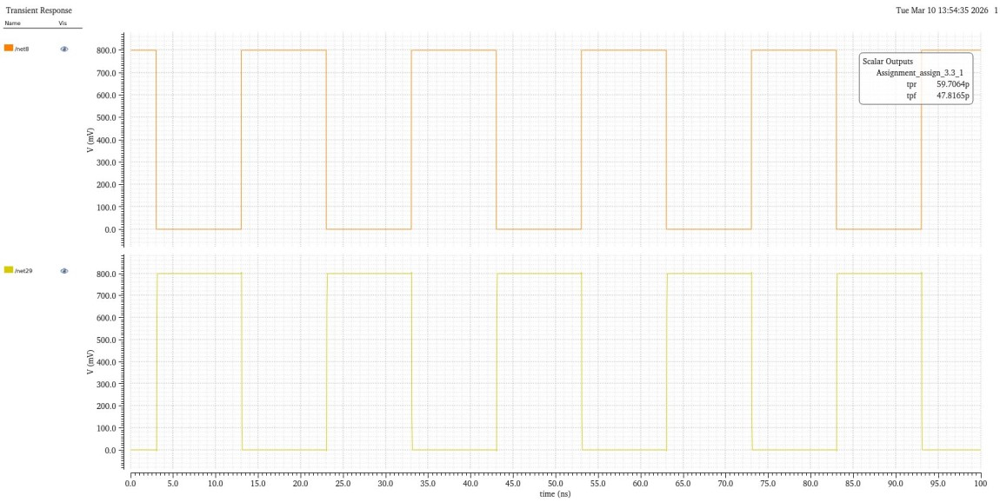

| Energy | Value |
|---|---|
| Static Energy (avg of '0'/'1' states) | 59.535 fJ |
| Dynamic Energy | 10.3146 pJ |
| Total Energy | 10.37 pJ |

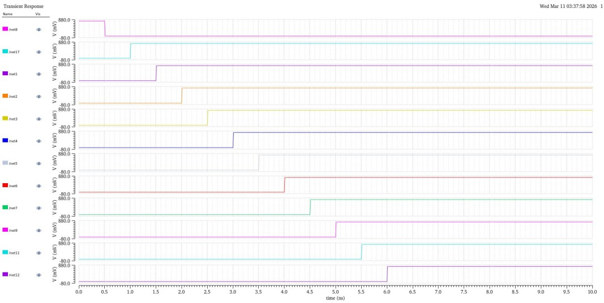

Restaging to the logical-effort-optimal 9 stages reduced average delay from **140.4 ps → 53.8 ps** (≈62% reduction), at the cost of additional dynamic energy from the extra buffer stages.

### 6.3 Engineering Trade-offs

| Optimization | Benefit | Cost |
|---|---|---|
| Smaller fan-in gates (2-input vs. 4-input) | Lower logical effort, lower delay | More gates/stages needed for the same logic |
| Buffer insertion (restaging to N=9) | Each stage effort matched to optimum, minimizes total delay | Increased area, additional dynamic power from extra stages |
| Larger transistor widths (P:N sizing) | Faster switching, matches drive strength to load | Higher input/parasitic capacitance |
| Additional stages overall | Better timing, closer to theoretical minimum | Higher total power, more layout complexity |

Every gain in this project came from spending area and power to buy delay — a standard trade-off in high-speed digital design, and the reason gate sizing is never a "more is always better" exercise.

---

## 7. Simulation Environment

| Parameter | Value |
|---|---|
| Tool | Cadence Virtuoso |
| Technology | FinFET-based device models (channel length l = 16 nm, fin-based transistor sizing) |
| Supply Voltage (VDD) | 0.8 V |
| Analysis Type | Transient |
| Output Load | 4000 units (Cout = 62,800 in normalized logical-effort units) |
| Unit Delay (τ) | 0.9006 ps (characterized via FO4 simulation) |

*(Process corner and temperature were not explicitly recorded in the original coursework; typical/nominal conditions are assumed.)*

---

## 8. Configuration Comparison — Topology Selection

Beyond staging, the choice of gate topology (2-input vs. 4-input NAND/NOR) changes the logical effort of the path itself. Three configurations were compared, each still using the logical-effort-optimal 9-stage path:

| Configuration | Gates Used |
|---|---|
| **Configuration 1** | NAND-2 + NOR-2 chain |
| **Configuration 2** | NAND-2, NOR-2, and NAND-4 |
| **Configuration 3** | NAND-2 and NOR-4 |

| Configuration 1 | Configuration 2 | Configuration 3 |
|---|---|---|
| 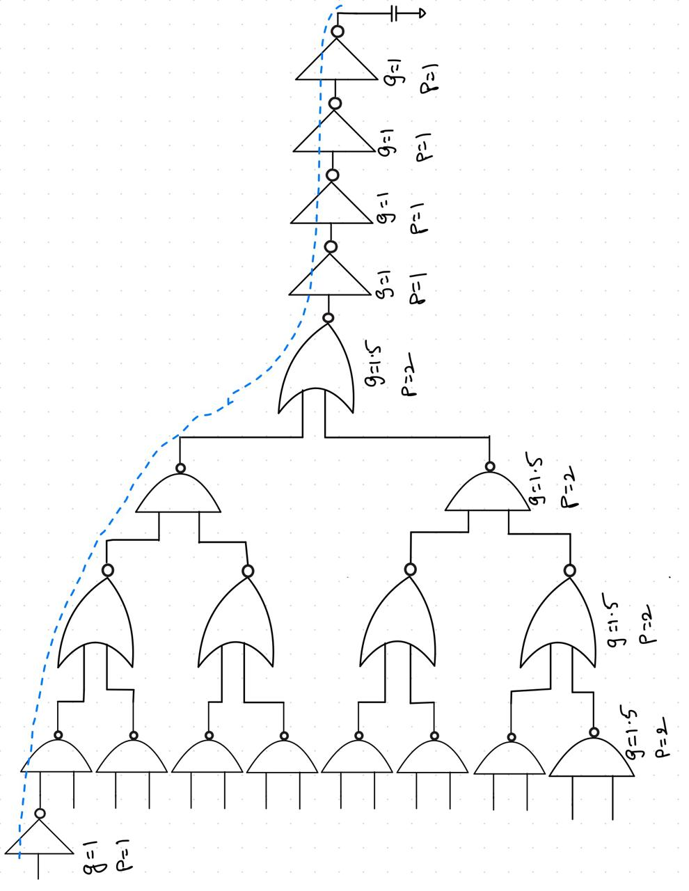 | 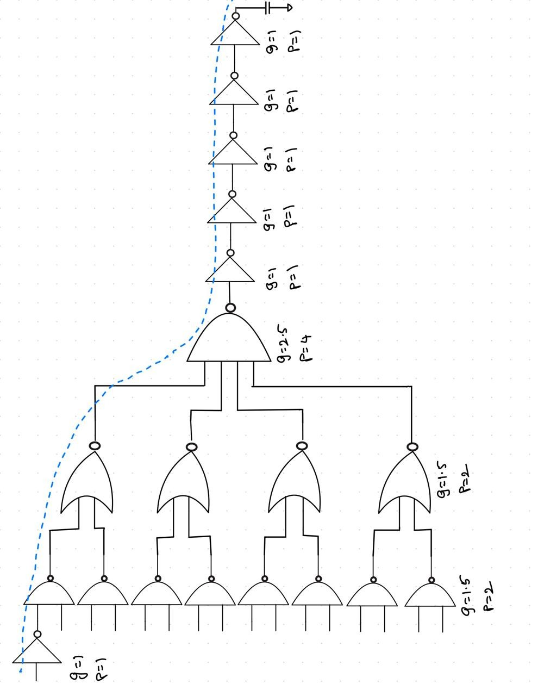 | 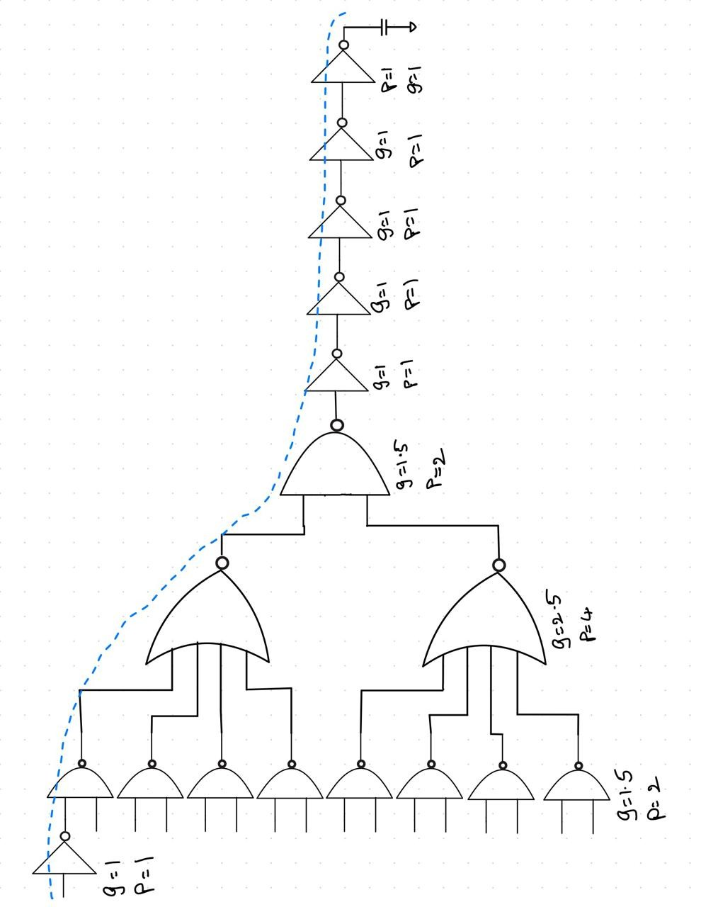 |

### Comparison Table

| Design | N (stages) | G (path effort) | d_min | D_abs (ps) |
|---|---|---|---|---|
| **Configuration 1** | 9 | 5.0625 | 44.50 | **40.05** |
| Configuration 2 | 9 | 5.625 | 45.896 | 41.31 |
| Configuration 3 | 9 | 5.625 | 45.896 | 41.31 |

---

## 9. Discussion

**Configuration 1 (all 2-input gates)** wins because 2-input NAND/NOR gates have the lowest logical effort per stage (G = 1.5 each) compared to 4-input gates (G = 2.5) — a smaller path effort translates directly into lower delay, even though more 2-input gates are needed to implement the same 16-input logic function. This is the central insight of logical effort theory: **delay is driven by effort per stage, not gate count** — a longer chain of "easy" gates can beat a shorter chain of "hard" ones.

The gap between calculated and measured delay was consistent across every design point in this project (baseline, buffered, and final configuration) — always in the same direction (measured higher than calculated), and shrinking in relative terms as the design was optimized. This is expected: the logical effort model is a first-order estimate that ignores parasitic and wiring capacitance, which matter proportionally less once the gates are already well-sized for their load.

---

## 10. Validation — Best Configuration

Configuration 1 was implemented at the transistor level with sizing recalculated for the new gate mix (2-input NAND and NOR gates throughout, sized via the same P:N ratio method as before) and re-simulated to confirm the theoretical prediction held under simulation.

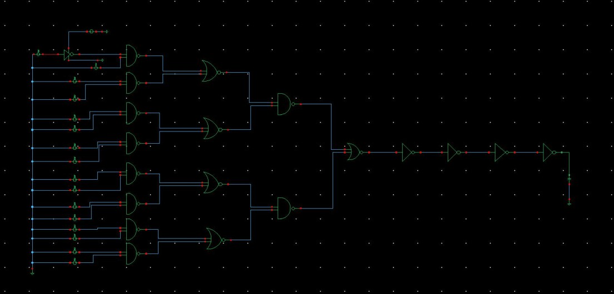

### Final Results

| Delay | Value |
|---|---|
| Rising Delay | 53.33 ps |
| Falling Delay | 42.2869 ps |
| Average Delay | 47.80 ps |

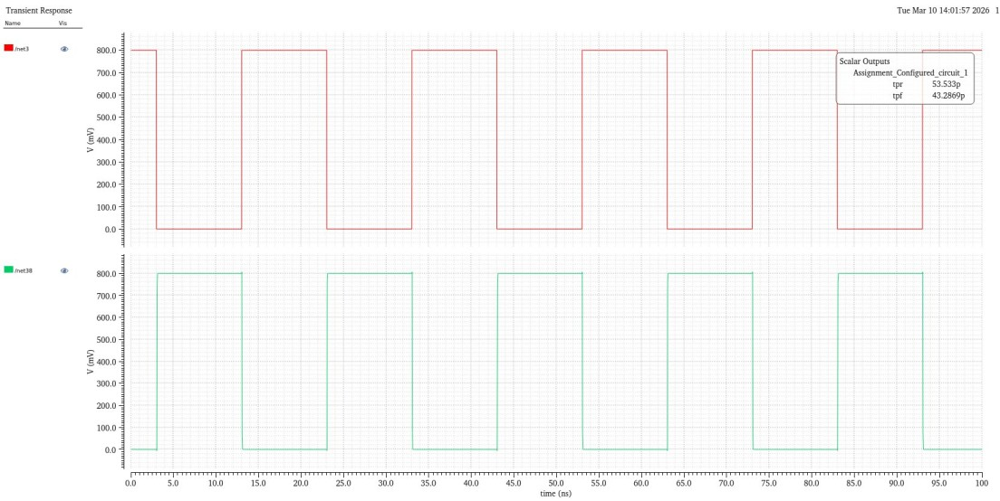

| Energy | Value |
|---|---|
| Static Energy | 59.64 fJ |
| Dynamic Energy | 10.380 pJ |
| Total Energy | 10.44 pJ |

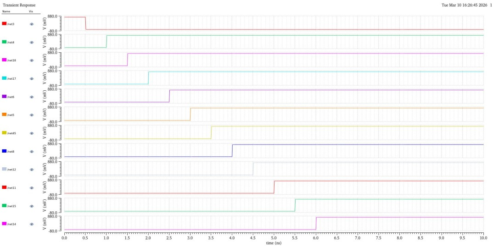

---

## 11. Results Summary

| Stage | Average Delay | Change from Baseline |
|---|---|---|
| Baseline (3-stage NAND4+NOR4) | 140.43 ps | — |
| Optimum staging (9-stage buffered) | 53.76 ps | ↓ 61.7% |
| Best configuration (9-stage, NAND-2/NOR-2) | 47.80 ps | ↓ 66.0% |

---

## 12. Key Takeaways

- Logical effort provided an accurate guide for selecting both gate decomposition and stage count, without relying on trial-and-error sizing.
- Restaging the logic path to its theoretically optimal length (N=9) was the single largest contributor to delay reduction — more than the topology choice itself.
- Smaller fan-in gates (2-input NAND/NOR) reduced path effort further, confirming that gate count matters less than per-stage effort.
- Simulation results consistently tracked theoretical predictions, with the gap explained by parasitic capacitance the first-order model doesn't capture.
- Careful transistor sizing at each stage was necessary to actually realize the delay predicted by the logical effort calculation — sizing and staging are complementary, not substitutes for one another.
- Combined, these techniques reduced average propagation delay by approximately **66% compared with the baseline** design.

---

## 13. Future Work

- Extend the comparison to additional gate topologies (e.g., NAND-3/NOR-3 mixes)
- Characterize the delay/energy trade-off across the full staging range (not just the logical-effort optimum)
- Repeat the design across different threshold-voltage libraries (SVT/LVT/HVT) to explore combined staging + Multi-VT optimization
- Evaluate the design under process, voltage, and temperature (PVT) variation

---

## 14. What I Learned

This project strengthened my understanding of logical effort as both an analytical and practical optimization technique. While theoretical calculations provided an effective starting point, simulation highlighted the influence of parasitic capacitances and transistor sizing on real circuit performance. Through iterative optimization in Cadence Virtuoso, I learned how architectural decomposition — choosing stage count and gate topology — and device-level sizing work together to achieve significant delay improvements, and that neither one alone gets you to the theoretical minimum.

---

## 15. Conclusion

This project demonstrates how logical effort theory guides three independent, compounding levers for delay minimization: restaging a logic path to its theoretically optimal length, sizing transistors stage-by-stage to match effort, and selecting the lowest-effort gate topology available for a given logic function. Applied together, they cut the 16-input AND gate's average propagation delay by roughly two-thirds relative to a naive single-pass NAND4+NOR4 implementation, while the measured results consistently tracked the hand-calculated predictions — with the expected gap attributable to parasitic capacitance not captured in the first-order logical effort model.

---

## License

This project is shared under the MIT License — see [LICENSE](LICENSE) for details.
